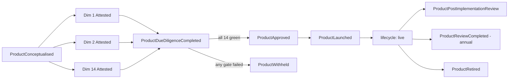

# Product-construction substrate — typed Product composition from CDM primitives

**Authors:** Atlas (Core banking platform architect — substrate authority) · Kai (trading systems engineer — markets implementation) · Saskia (Head of Global Markets — franchise authority)
**Reports through:** Atlas → Devon (COO); Kai → Saskia (Head of Global Markets); Saskia → CEO
**Pair briefs:** `Owner Inbox/2026-05-07_saskia-kai_global-markets-trading-system-architecture.md` (D-MARKETS-SCHEMA-FOUNDATION — CDM as canonical schema; primitive catalogue §4; composition examples §5; M-phase ordering §10). `Owner Inbox/2026-05-10_atlas_event-store-scaling-design.md` (PR #38 — retention + compaction discipline the new event types respect). `Owner Inbox/2026-05-09_atlas_substrate-completeness-budget.md` (Targeted budget that paces the slices). The parallel-stream **New Product Approval Policy** (Saskia leading; in-flight) is the *what* this substrate provides the *how* for.
**Date:** 2026-05-10
**For:** Marc (CEO)
**Authority:**
- CLAUDE.md Principle 1 (events as truth — Product approval, dimension attestation, and lifecycle progression are typed events, not stored state)
- CLAUDE.md Principle 2 (every action carries a citation — Product objects and dimension attestations carry typed citation chains)
- CLAUDE.md Principle 5 (multi-currency, multi-entity — every Product names its `currencies[]` and `entityScope[]`)
- CLAUDE.md Principle 6 (single-graph discipline — Product → Procedure → Policy → Regulation chain made bidirectionally testable)
- CLAUDE.md Principle 7 (autonomous by default — per-dimension agents emit their own attestations)
- CEO directive 2026-05-09: *"a way of constructing a product from primitives, and then ensure the products (M1-4) are in line with the policy"*
- D-MARKETS-SCHEMA-FOUNDATION (approved 2026-05-07) — CDM primitives are the building blocks
- D-NEW-PRODUCT-APPROVAL-POLICY (in-flight; this substrate is its operational counterpart)
- `project_strategic_foundation.md` — institutional-only / wholesale; product scope bounded
- `feedback_canonical_source_registry.md` — single canonical authoring location per fact-type
- `feedback_reg_policy_procedure_capability_chain.md` — implementation chain
**Status:** Specification only — no code lands on this brief. Approval governs the shape of the eight slices in §6.

> **Derivation note (Principle 6 — downward).** This brief sits at the *standard* layer. It cites the approved schema foundation (D-MARKETS-SCHEMA-FOUNDATION), the in-flight policy (D-NEW-PRODUCT-APPROVAL-POLICY), the obligations register (Domain J markets/trading; Domain N M1 markets-foundation URNs), the procedures index, and Atlas's substrate-completeness budget. It authors no principle-level substance.

---

## 1. What this brief asks

Marc's directive of 2026-05-09 is two-stranded: *"a way of constructing a product from primitives"* (substrate question) and *"ensure the products M1-4 are in line with the policy"* (governance question). The two strands are coupled — the policy can only attest against *something*, and that something has to be typed, canonical, and queryable. Today the bank has the CDM primitives (Asset, Schedule, Cashflow, Settlement, Identification, plus the family schemas in `prototype/platform/markets/cdm/equity.ts`) and it has the M1 equity event family. What it does not have is the **typed Product composition layer** between them: the single canonical record that says *"Product `prd:bank:equity:jse-equity-cash` is this combination of primitives, attests against this policy, lives at this lifecycle stage, runs under these conditions."* Without that layer, products live implicitly in handler code, the policy has no anchor to attest against, and the Principle 6 single-graph chain (Product → Procedure → Policy → Regulation) breaks at the Product node.

This brief specifies the substrate. A parallel-stream brief (Saskia leading) specifies the policy — the gates a product must clear. The two converge in a third slice that produces per-product attestations of M1 (listed equities, end-to-end), M2 (bonds + repo, design-attestations), M3 (OTC IRS, design-attestation), and M4 (FX swaps, design-attestation) against the policy. This is design only; no code in this slice.

---

## 2. The Product type — schema design

The Product type is a single canonical TypeScript discriminated union, lives at `prototype/platform/markets/products/types.ts` (slice 1), and is consumed by every downstream substrate (event registry, projections, attestation runtime, dashboard derivation). Shape sketched below in TS-flavoured pseudo-code; the slice 1 deliverable is the full Zod-validated shape.

```ts
type ProductFamily =
  | "listed-equity"
  | "listed-bond"
  | "repo"
  | "otc-ird"
  | "fx"
  | "structured";

type ProductLifecycleStage =
  | "proposed"
  | "conceptualised"
  | "due-diligence"
  | "approved-conditional"
  | "controlled-launch"
  | "live"
  | "under-review"
  | "retired";

interface Product {
  /** URN: prd:bank:<asset-class>:<slug>. Stable; never reused. */
  productId: string;                           // e.g. "prd:bank:equity:jse-equity-cash"
  family: ProductFamily;                        // discriminator; ties to M-phase
  version: string;                              // semver; new versions = ProductVersionPublished
  name: string;                                 // human-readable
  description: string;                          // human-readable; one paragraph

  /** Bounded by project_strategic_foundation.md. */
  franchiseScope: "institutional" | "wholesale";

  /** How CDM primitives compose into this product's atomic instrument. */
  cdmComposition: {
    primitives: PrimitiveRef[];                 // refs to types in @platform/markets/cdm
    extensions: ExtensionRef[];                 // SA-specific or franchise add-ons
    compositionRule: string;                    // narrative + structured spec; consumed by composeProduct()
  };

  /** Typed event types that make up this product's per-trade lifecycle. */
  lifecycleEventFamily: string[];               // e.g. ["EquityTradeBooked", "EquityCorporateActionApplied", "EquitySettlementInstructed"]

  /** Risk shape — populated dimension by dimension. */
  riskProfile: {
    marketRiskDimensions: ("delta" | "gamma" | "vega" | "theta" | "rho" | "curve" | "basis")[];
    creditRiskShape: "no-counterparty" | "principal-on-settlement" | "ongoing-bilateral-exposure";
    liquidityClassification: "hqla-eligible-l1" | "hqla-eligible-l2a" | "hqla-eligible-l2b" | "non-hqla";
    fundingProfile: "cash-funded" | "repo-funded" | "uncollateralised" | "csa-collateralised";
    modelRiskTier: "tier-1" | "tier-2" | "tier-3";   // Nadia methodology
  };

  /** Accounting shape — populated by Bea, signed by Camille. */
  accountingClassification: {
    ifrs9Family: "amortised-cost" | "fvtpl" | "fvoci";
    ifrs13FairValueHierarchy: "level-1" | "level-2" | "level-3";
    ias21FxTreatment: "monetary" | "non-monetary" | "n/a";
    baReturnLineMapping: string[];              // e.g. ["BA100.line.34", "BA200.line.18"]
  };

  /** Legal documentation requirements — Imani's clause library. */
  legalDocumentation: {
    masterAgreement: "isda-2002" | "isda-2025" | "gmra-2011" | "gmsla-2018" | "none-listed";
    ectaExecutionPath: "electronic-default" | "wet-signature-required" | "hybrid";
    jurisdictionMatrix: string[];               // ISO-3166-1 alpha-2 codes
  };

  /** Operational shape. */
  operationalReadiness: {
    settlementPath: string;                     // e.g. "Strate T+3", "bilateral cash", "Strate-bond"
    reconciliationCadence: "intraday" | "daily" | "weekly";
    substrateCompletenessGate: string;          // M-phase exit ref (e.g. "M1-exit", "M2-exit")
  };

  /** Security shape — Senna threat-model + Rashida policy. */
  securityProfile: {
    threatModelRef: string;                     // citation URN
    hsmCustodyRequired: boolean;
    zeroTrustPosture: "default" | "elevated";
  };

  /** Policy attestations — produced by the per-dimension agents (slice 4). */
  policyAttestations: {
    policy: "D-NEW-PRODUCT-APPROVAL-POLICY";
    version: string;
    attestedAt: string;                         // ISO-8601
    attestedBy: string;                         // agent or human ref
    gatesCleared: string[];                     // dimension names
    conditions: string[];                       // any conditions imposed at approval
  }[];

  /** Current lifecycle stage — derived from the event log, never authored. */
  lifecycle: ProductLifecycleStage;

  /** Principle 2 chain — regulatory + standards + internal. */
  citations: string[];                          // URN array; non-empty enforced

  /** Principle 5 — multi-entity, multi-currency mandatory. */
  entityScope: string[];                        // legal-entity IDs (Imani's tree)
  currencies: string[];                         // ISO 4217 codes
}

/** A typed reference into the CDM primitives module. */
interface PrimitiveRef {
  module: "@platform/markets/cdm/primitives" | "@platform/markets/cdm/equity" | "@platform/markets/cdm/<bond|repo|ird|fx>";
  symbol: string;                               // e.g. "instrumentSchema", "moneySchema", "scheduleSchema"
  role: string;                                 // role this primitive plays in the composition
}

interface ExtensionRef {
  name: string;                                 // e.g. "JSE corporate-actions"
  module: string;                               // module path
  citationUrn: string;                          // P2 anchor for the extension's source
}
```

Twelve required fields, each with a typed shape. The slice 1 deliverable is the Zod-validated TypeScript module; this brief is the design contract.

---

## 3. The composition rule — how primitives become a Product

A Product is not an interface a handler implements; it is a typed object that composes CDM primitives into a deterministic ProductTemplate the markets substrate then instantiates per-trade. The composition rule is a typed function:

```ts
function composeProduct(
  primitives: PrimitiveRef[],
  extensions: ExtensionRef[]
): ProductTemplate;
```

`ProductTemplate` is the runtime-resolved view: each primitive resolved against its module, each extension validated, the composition rule asserted (e.g. "every product with `repo` family must include a `Collateral` primitive"). The same primitives compose every product; the difference between an equity trade and a Bermudan swaption is the *combination*, not the building blocks. Five worked examples follow.

### 3.1 M1 — JSE listed equity (cash)

`productId: "prd:bank:equity:jse-equity-cash"` · family `listed-equity` · live today.

| Primitive | Module | Role |
|---|---|---|
| `instrumentSchema` (class: `listed-equity`) | `cdm/primitives.ts` | The equity itself |
| `identifierSchema` (scheme: `ISIN`) | `cdm/primitives.ts` | JSE-ISIN |
| `cdmDateSchema` (calendar: `JIHCAL`) | `cdm/primitives.ts` | Trade + settlement dates (T+3) |
| `priceSchema` · `quantitySchema` | `cdm/primitives.ts` | Execution price × shares |
| `moneySchema` | `cdm/primitives.ts` | Consideration in ZAR |
| `partySchema` (role: `counterparty`, `custodian`) | `cdm/primitives.ts` | Counterparty + Strate as CSD |
| `equitySettlementInstructedPayloadSchema` | `cdm/equity.ts` | Strate physical-settlement leg |
| **Extension:** JSE corporate-action types | `cdm/equity.ts` (`corporateActionTypeSchema`) | Cash dividend, scrip, split, rights, M&A |

Composition rule: `Asset(equity) + Identification(ISIN) + Schedule(T+3, JIHCAL) + Cashflow(consideration + commission) + Settlement(Strate, physical) + corporate-action extensions`. The lifecycle event family is the existing `EquityTradeBooked` → `EquityCorporateActionApplied` → `EquitySettlementInstructed`.

### 3.2 M2 — Vanilla fixed-coupon SAGB bond

`productId: "prd:bank:bond:sagb-fixed-coupon"` · family `listed-bond` · M2.

| Primitive | Module | Role |
|---|---|---|
| `instrumentSchema` (class: `listed-bond`) | `cdm/primitives.ts` | The bond |
| `identifierSchema` (scheme: `ISIN`) | `cdm/primitives.ts` | SAGB ISIN |
| `cdmDateSchema` × N | `cdm/primitives.ts` | Coupon schedule (semi-annual) + maturity |
| `priceSchema` · `moneySchema` | `cdm/primitives.ts` | Clean / dirty price; consideration |
| `quantitySchema` (unit: `bond-face`) | `cdm/primitives.ts` | Face-value held |
| Schedule primitive (planned M2 in `cdm/bond.ts`) | `cdm/bond.ts` | Coupon + redemption schedule |
| Cashflow primitive (Fixed) | `cdm/bond.ts` | Fixed coupon + redemption |
| **Extension:** accrued-interest day-count | `cdm/bond.ts` | ACT/365 SA convention |

Composition: `Asset(bond) + Identification(ISIN) + Schedule(coupon + maturity) + Cashflow(fixed-coupon + redemption) + Settlement(Strate-bond)`. Lifecycle: `BondTradeBooked` → `BondCouponPaid` × N → `BondRedeemed` → `BondSettlementInstructed`. Slice 2 registers these event types.

### 3.3 M2 — Open repo (GMRA-framed)

`productId: "prd:bank:repo:open-repo-gmra"` · family `repo` · M2.

| Primitive | Module | Role |
|---|---|---|
| `instrumentSchema` (class: `repo`) | `cdm/primitives.ts` | Repo wrapper |
| **Reusable**: `instrumentSchema` (class: `listed-bond`) | `cdm/primitives.ts` | The collateral bond |
| `cdmDateSchema` × 2 | `cdm/primitives.ts` | Repo-leg-1 (open) + leg-2 (close) |
| `moneySchema` × 2 | `cdm/primitives.ts` | Cash leg-1 + cash leg-2 (with repo rate) |
| Collateral primitive (planned M2 in `cdm/repo.ts`) | `cdm/repo.ts` | Haircut + valuation agent |
| **Extension:** GMRA framework binding | Imani clause library | Master agreement linkage |

Composition: `Asset(reusable: bond) + Schedule(repo-leg-1 + repo-leg-2) + Cashflow(repo-rate-funding) + Settlement(Strate-repo) + Collateral(haircut)`. Lifecycle: `RepoOpened` → `RepoMargined` × N → `RepoClosed`. The collateral primitive is the new building block M2 introduces.

### 3.4 M3 — Vanilla ZAR fixed-vs-ZARONIA IRS

`productId: "prd:bank:ird:vanilla-zar-fix-zaronia"` · family `otc-ird` · M3.

| Primitive | Module | Role |
|---|---|---|
| `instrumentSchema` (class: `otc-irs`) | `cdm/primitives.ts` | The contract |
| Leg primitive × 2 (planned M3 in `cdm/ird.ts`) | `cdm/ird.ts` | Fixed leg, floating leg |
| Schedule (semi-annual, JIHCAL) | `cdm/primitives.ts` (extended) | Payment cycle |
| Schedule (quarterly, daily compounding) | `cdm/primitives.ts` (extended) | Reset cycle |
| Index primitive (`ZARONIA`, source SARB) | `cdm/ird.ts` | Floating-rate observable |
| Cashflow (Fixed) + Cashflow (Floating) | `cdm/ird.ts` | Per-leg payouts |
| Collateral primitive (CSA: ISDA Master + CSA) | `cdm/ird.ts` | IM/VM via SIMM, ZAR cash + SAGB eligible |
| **Extension:** ISDA Master clause-library hooks | Imani clause library | ECTA execution path |

Composition: `Asset(reusable: rate-leg) + Schedule(reset + payment) + Cashflow(fixed-leg + floating-leg) + Index(ZARONIA) + Leg×2 + Collateral(CSA)`. Lifecycle: `IrsTradeExecuted` → `IrsReset` × N → `IrsInterestPaid` × N → `IrsTerminated` | `IrsMatured`.

### 3.5 M4 — FX swap (USD/ZAR)

`productId: "prd:bank:fx:fx-swap-usdzar"` · family `fx` · M4.

| Primitive | Module | Role |
|---|---|---|
| `instrumentSchema` (class: `fx-swap`) | `cdm/primitives.ts` | The swap |
| FX-leg Asset × 2 (planned M4 in `cdm/fx.ts`) | `cdm/fx.ts` | Near-leg + far-leg |
| `cdmDateSchema` × 2 | `cdm/primitives.ts` | Near + far settlement dates |
| `moneySchema` × 4 | `cdm/primitives.ts` | USD + ZAR cash legs (×2 dates) |
| Settlement (PvP via correspondent / sponsor) | `cdm/fx.ts` | Indirect-participant posture per `project_indirect_participant_posture.md` |
| **Extension:** FATCA/CRS counterparty classification gate | `cdm/fx.ts` | Cross-border tax treatment |

Composition: two FX-leg Assets + two settlement instructions + jurisdictional FATCA/CRS gate. Lifecycle: `FxSwapExecuted` → `FxSwapNearLegSettled` → `FxSwapFarLegSettled`.

The five examples share the same five core primitives (`Asset`, `Schedule`, `Cashflow`, `Settlement`, `Identification`); each adds the family-specific extension. This is the asset Marc asked for — a new structured product is a new combination of existing building blocks, not a new engineering project.

---

## 4. Typed-event surface (the 12 product-lifecycle events)

These are *Product-lifecycle* events, distinct from per-trade lifecycle events (the latter are family-specific, e.g. `EquityTradeBooked`). Slice 2 registers all 12 in `event-types.ts` and `registry.ts`. Each row: schema sketch + Principle-2 citation chain + retention class per Atlas's PR #38 (`append-only-audit` is the dominant fold; product approval is auditably permanent).

| # | Event type | Payload sketch | Citation chain (P2) | Retention |
|---|---|---|---|---|
| 1 | `ProductProposalRegistered` | `{productId, family, proposedBy, asOf}` | `D-MARKETS-SCHEMA-FOUNDATION` + Saskia mandate | `append-only-audit` |
| 2 | `ProductConceptualised` | `{productId, version, cdmComposition, lifecycleEventFamily}` | `D-MARKETS-SCHEMA-FOUNDATION` + CDM primitives module ref | `append-only-audit` |
| 3 | `ProductDueDiligenceCompleted` | `{productId, gatesCleared[], gatesFailed[]}` | `D-NEW-PRODUCT-APPROVAL-POLICY` + per-dimension URNs | `append-only-audit` |
| 4 | `ProductDueDiligenceWithheld` | `{productId, gatesFailed[], remediation}` | `D-NEW-PRODUCT-APPROVAL-POLICY` | `append-only-audit` |
| 5 | `ProductDimensionAttested` | `{productId, dimension, result, citationChain}` | per-dimension URN (Domain N for M1; Domain J for trading) | `append-only-audit` |
| 6 | `ProductApproved` | `{productId, version, conditions[], approvedBy}` | `D-NEW-PRODUCT-APPROVAL-POLICY` + BCBS new-product principles | `append-only-audit` |
| 7 | `ProductWithheld` | `{productId, version, reason}` | `D-NEW-PRODUCT-APPROVAL-POLICY` | `append-only-audit` |
| 8 | `ProductLaunched` | `{productId, version, controlledLaunchLimits, launchedAt}` | `D-NEW-PRODUCT-APPROVAL-POLICY` + Helena RAS tier | `append-only-audit` |
| 9 | `ProductPostImplementationReviewCompleted` | `{productId, verdict, amendedConditions[]}` | `D-NEW-PRODUCT-APPROVAL-POLICY` | `append-only-audit` |
| 10 | `ProductReviewCompleted` | `{productId, cycle, verdict}` (annual) | `D-NEW-PRODUCT-APPROVAL-POLICY` | `append-only-audit` |
| 11 | `ProductRetired` | `{productId, reason, migrationPath}` | `D-NEW-PRODUCT-APPROVAL-POLICY` + Imani migration-clause | `append-only-audit` |
| 12 | `ProductVersionPublished` | `{productId, oldVersion, newVersion, materialChanges[]}` | `D-NEW-PRODUCT-APPROVAL-POLICY` | `append-only-audit` |

Replay-fold rule for all 12: `append-only-audit`. The Product's *current state* (lifecycle stage, conditions, gates cleared) is a projection over this stream — never stored as authoritative.

`[register: route to Mira]` — the URN slugs `D-NEW-PRODUCT-APPROVAL-POLICY` and the per-dimension policy URNs require population in `Regulations/_obligations-register.md` once the parallel-stream policy lands.

---

## 5. The policy-attestation seam

This is the connection point between this brief and the parallel-stream New Product Approval Policy. The seam has four moving parts.

**(a) The policy enumerates ~14 gate dimensions.** Saskia's parallel brief defines them; the substrate is dimension-agnostic. The expected dimension set: *market-risk · credit-risk · liquidity-risk · operational-risk · operational-readiness · accounting · capital · conduct · AML · model-risk · legal · infosec · privacy · tax*.

**(b) Each gate dimension binds to a responsible agent.** Per Principle 7, the per-dimension agent emits its own attestation (Q2 recommendation). The expected mapping:

| Dimension | Responsible agent (governance) | Engineering implementation |
|---|---|---|
| market-risk | Helena (CRO) | Rohan |
| credit-risk | Helena (CRO) | Rohan |
| liquidity-risk | Eitan (Treasurer) | Ravi |
| operational-risk | Devon (COO) | Atlas / Tomas |
| operational-readiness | Devon (COO) | Atlas / Tomas |
| accounting | Camille (CFO) | Bea |
| capital | Camille (CFO) | Bea / Rohan |
| conduct | Zara (CCO) | Mira |
| AML | Zara (CCO) | Mira |
| model-risk | Helena (CRO) | Nadia |
| legal | (interim Devon → future GC) | Imani |
| infosec | Rashida (CISO) | Senna |
| privacy | Iris (IO) | Senna |
| tax | Camille (CFO) | Yael |

**(c) Each agent emits a `ProductDimensionAttested` event.** Payload: `{productId, dimension, result, citationChain}`. `result` is `"design-attested"` (Q3 distinction — substrate-not-yet-built; the gate is design-clear) or `"implementation-attested"` (substrate built, gate runtime-clear). The citationChain is the Principle 2 anchor: typically the obligations-register URN(s) the dimension binds to.

**(d) `ProductApproved` is gated by attestation completeness.** A `ProductApproved` event cannot validly fire until all 14 (or applicable count) `ProductDimensionAttested` events have landed for the same `productId @ version`. Vera's slice-8 recon asserts this discipline; a `ProductApproved` without the matching attestation set is a finding.

**Worked example — M1 listed equities, end-to-end:**

1. Saskia constructs the `prd:bank:equity:jse-equity-cash` Product per §2 (slice 5).
2. The substrate dispatches each of the 14 dimensions to its responsible agent (or surfaces a manual-attestation card where the agent doesn't yet exist).
3. Each dimension emits `ProductDimensionAttested { productId, dimension, result, citationChain }`. M1 is *implementation-attested* on dimensions where the substrate exists today (accounting via Bea's IFRS classifier; legal via Imani's clause library; operational-readiness via the existing equity event family); *design-attested* where it doesn't (capital, model-risk pending Rohan/Nadia substrate).
4. When all 14 land, `ProductApproved { productId, version, conditions[], approvedBy }` fires (BRC, or interim CEO).
5. The policy register's "On product" cadence row binds; the Product transitions to `lifecycle: "approved-conditional"`. `ProductLaunched` follows once the controlled-launch limits are defined.



---

## 6. Substrate sequencing — eight slices

Each slice: owner · prerequisite · exit criterion · target M-phase. Slices 1–3 land under the Targeted budget pre-M2 — they are the load-bearing pieces every consumer authors against. Slices 4–8 sequence after both this brief and the New Product Approval Policy land, paced by M-phase exits.

| # | Slice | Owner | Pre-req | Exit criterion | M-phase |
|---|---|---|---|---|---|
| 1 | **Product type definition** — author `prototype/platform/markets/products/types.ts` per §2; Zod-validated; tested with M1 listed-equity fixture | Atlas + Kai | This brief approved | Type compiles; M1 fixture round-trips through Zod parse; substrate-state surfaces `productId` count | Pre-M2 |
| 2 | **Product-lifecycle event family** — register the 12 event types from §4 in `event-types.ts` + `registry.ts`; subscribers + replay-fold + retention metadata per PR #38 | Atlas | Slice 1 | All 12 land in registry; Vera's `runtime-handler-sync` recon green; 12 entries surface in dashboard substrate-state | Pre-M2 |
| 3 | **Composition runtime** — implement `composeProduct(primitives, extensions): ProductTemplate` in `prototype/platform/markets/products/`; M1 fixture composes; M2 design-only fixture composes | Kai | Slices 1–2 | M1 listed-equity + M2 SAGB-bond fixtures compose deterministically; unit tests green | Pre-M2 / pre-M3 |
| 4 | **Policy-attestation runtime** — the function that walks the 14 gate dimensions, dispatches to responsible agents (or surfaces manual cards), assembles into `ProductDueDiligenceCompleted`; emits per-dimension attestations | Atlas + Saskia | Slice 2 + New Product Approval Policy landed | M1 attestation run produces 14 typed `ProductDimensionAttested` events; orchestrator emits `ProductDueDiligenceCompleted` | Sequenced after both substrate + policy land |
| 5 | **M1 attestation — listed equities, end-to-end** — Saskia constructs the M1 Product per §2; substrate runs all 14 dimensions; first product approved end-to-end | Saskia (lead) + per-dimension agents | Slices 1–4 | `ProductApproved { productId: "prd:bank:equity:jse-equity-cash" }` lands; conditions captured; substrate-state shows M1 lifecycle = `live` | Pre-M2 |
| 6 | **M2–M4 design-attestations** — per-product design-attestations against the policy: M2 SAGB bond + open repo; M3 vanilla IRS; M4 FX swap. Each emits 14 `ProductDimensionAttested` with `result: "design-attested"` and any substrate gaps named in `citationChain` | Saskia + Kai (lead) + per-dimension agents | Slice 5 | Four `ProductApproved` (or `ProductDueDiligenceCompleted` with explicit gates-failed) events for M2 (×2), M3, M4; gap inventory per product | Pre-M3 (M2) / pre-M4 (M3) / pre-M5 (M4) |
| 7 | **Per-dimension agent extension** — for any dimension where no agent yet exists (e.g. capital-impact RWA-delta engine pending Rohan substrate; model-risk attestation pending Nadia methodology library), the substrate falls back to manual-attestation; this slice tracks the gaps and builds the agents | per-dimension agents (Rohan, Nadia, etc.) | Slice 6 surfaces gaps | Each manual-attestation card has a named substrate gap and an owner; gaps are roadmap items in the substrate-completeness budget | Sequenced; per dimension |
| 8 | **Vera attestation-integrity recon** — every `ProductApproved` is preceded by 14 (or applicable count) `ProductDimensionAttested` events for the same `productId @ version`; orphan attestations are findings; missing dimensions are findings; lifecycle-stage transitions match the event sequence | Vera | Slices 4–6 | Recon pipeline lives in `@platform/recon/`; passes on M1; surfaces M2–M4 gaps as expected findings | Sequenced after slices 4–5 |

Each slice is testable (unit + integration fixture) and measurable (artefact count, recon green/amber/red, dashboard substrate-state row).

---

## 7. Open questions for Marc

| # | Question | Authors' recommendation | Default if no decision |
|---|---|---|---|
| **Q1** | One canonical `Product` type discriminated by `family`, or one type per family (`EquityProduct`, `BondProduct`, `IrsProduct`)? | One canonical type with `family` discriminator. Cleanest single-graph (Vera recon walks one schema); per-family additions land as discriminated-union branches; matches the CDM posture of "one schema, many compositions". | One canonical type. |
| **Q2** | Should `ProductDimensionAttested` be emitted by the responsible agent (Bea emits accounting-attestation; Mira emits AML-attestation) or by a central orchestrator (`saskia:product-attestation-orchestrator`)? | Per-dimension agent emits its own attestation. Matches Principle 7 (the agent owns the decision in scope of its mandate); orchestrator only sequences and assembles into `ProductDueDiligenceCompleted`. Avoids a single orchestrator with read-into-every-agent's-mandate. | Per-dimension agent emits. |
| **Q3** | For M2–M4 (not yet built), should design-attestations be persisted as typed events, or only as Owner Inbox briefs? | Typed `ProductDimensionAttested` events with `result: "design-attested"` (vs `"implementation-attested"`). Preserves single-graph discipline; surfaces in Vera's recon today; the design→implementation transition becomes a typed event-pair under one `productId`. | Typed events with the design-vs-implementation distinction. |
| **Q4** | When `ProductDueDiligenceCompleted` shows gates failed, does the product auto-progress to `ProductWithheld` or wait for explicit BRC/CEO decision? | Explicit decision. Matches the CEO-decision-record pattern; auto-progress would bypass governance. The substrate emits `ProductDueDiligenceCompleted { gatesFailed[] }`, lifts a Decisions-for-CEO card, and waits. | Explicit decision. |
| **Q5** | Versioning: when a product has a material change (e.g. M1 adds JSE-ETF support), is that a `ProductVersionPublished` event on the same `productId`, or a new `productId`? | Same `productId` with version increment. Preserves continuity (position projections, sub-ledger postings, conditions) under a stable URN; a *new* `productId` is reserved for genuinely new products (e.g. the first OTC IRS is not a version of the first equity). | Same productId + version. |

---

## 8. Substrate gaps surfaced

Things this brief explicitly does *not* solve. Each is a roadmap item; none is a blocker for slices 1–3.

- **Pricing-model registration** (per Nadia methodology) — orthogonal; the policy's *model-risk* gate references it, but the registration substrate is Nadia's deliverable. Slice 7 manual-attestation falls back here until Nadia ships.
- **Counterparty onboarding** (Niko, paused per `project_ai_driven_bank.md`) — orthogonal; products land before customer lifecycle activates. The policy's *AML* and *conduct* gates reference Mira's RMCP; pre-licence the gates use synthetic counterparty fixtures.
- **Cross-product portfolio composition** (e.g. structured product combining IRS + option) — out of scope; M5 territory and per the parallel `Owner Inbox/2026-05-07_saskia-kai_global-markets-trading-system-architecture.md` §3 the structured-products family is M5+.
- **Real-time product-level position projection** — orthogonal; Anya's projection runtime per-M-phase per `2026-05-07_anya_projection-drift.md`. The Product object names `lifecycleEventFamily`; the projection that folds those events into per-product positions is downstream.
- **RWA-delta engine** for the *capital* gate — pending Rohan substrate; until built, the capital-impact attestation is design-attested only.
- **Trade-confirmation generators** for M3 — pending Imani clause library M3 deliverable per the architecture proposal §12.

---

## 9. Procedure binding (Principle 6)

The substrate binds to these procedures (each cites its parent policy):

- `Procedures/by-policy/new-product-due-diligence.md` (planned) — the cycle that consumes slices 4–5; the procedure names `ProductConceptualised` as the trigger and `ProductDueDiligenceCompleted` as the exit.
- `Procedures/by-policy/product-controlled-launch.md` (planned) — defines the controlled-launch limits the `ProductLaunched` event carries.
- `Procedures/by-policy/product-post-implementation-review.md` (planned) — annual cadence; emits `ProductPostImplementationReviewCompleted`.
- `Procedures/by-policy/product-retirement-migration.md` (planned) — names the migration-path field on `ProductRetired` and binds to Imani's legal-entity-tree update.
- `Procedures/by-policy/event-schema-evolution.md` (planned) — the meta-procedure under which the 12 new event types in §4 register; binds the registry-change discipline.

Each procedure cites D-NEW-PRODUCT-APPROVAL-POLICY (parent) and, where relevant, the obligations-register URN (Domain J markets/trading; Domain N M1 markets-foundation).

---

## 10. Authority

Citations supporting this brief:

- **CLAUDE.md** Principles 1, 2, 5, 6, 7 (single-graph discipline; events as truth; multi-X; autonomous-by-default)
- **D-MARKETS-SCHEMA-FOUNDATION** (CEO approved 2026-05-07) — CDM as canonical schema; primitive catalogue; M-phase ordering
- **D-NEW-PRODUCT-APPROVAL-POLICY** (in-flight; this substrate is its operational counterpart) `[register: route to Owen — bind once landed]`
- **Strategic foundation** — institutional global-markets dealer (`project_strategic_foundation.md`) — wholesale / institutional posture; product scope bounded
- **BCBS new-product-approval principles** — *Principles for the Sound Management of Operational Risk* (BCBS 195, 2011) — naming the new-product-approval discipline as a sound-practice principle
- **FSCA Conduct Standards 1–3 of 2018** — market-conduct; FSCA-CONDUCT-STANDARD-MARKET-CONDUCT URN already in `Regulations/_obligations-register.md`
- **Banks Act 94 of 1990, Reg 39** — model risk, product control, governance over new products `[register: route to Mira — confirm Reg 39 sub-clauses bind on product approval]`
- **Domain N** (M1 markets-foundation citation URNs) and **Domain J** (markets/trading) of the obligations register — the citation surface the per-dimension attestations cite into
- **PR #38 — event-store scaling design** (`Owner Inbox/2026-05-10_atlas_event-store-scaling-design.md`) — retention + compaction discipline the 12 new event types respect
- **Operating model — `feedback_canonical_source_registry.md`** — single canonical authoring location per fact-type; the Product type is the canonical authoring location for "what the bank trades and how"

No invented citations. URNs flagged `[register: route to Mira]` are real obligations whose URN slugs require population once the parallel-stream policy lands.

---

## 11. Change log

| Version | Date | Author | Change |
|---|---|---|---|
| v0.1 | 2026-05-10 | Atlas + Kai + Saskia | Initial proposal — Product type schema (§2); composition rule (§3, five worked examples); 12-event lifecycle family (§4); policy-attestation seam (§5); eight substrate slices (§6); five open questions; substrate gaps; procedure binding; authority citations. Design only; no code. |

—Atlas (substrate authority) · Kai (markets engineering) · Saskia (franchise authority)
