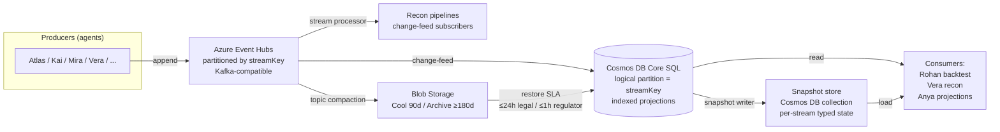

# Event-store scaling design — snapshots, partitioning, archival, compaction

**Author:** Atlas (Core banking platform architect)
**Reports through:** Devon (COO)
**Pair briefs:** S8 — `Owner Inbox/2026-05-07_atlas_agent-runtime-substrate-spec.md` (substrate baseline). S7 — `Owner Inbox/2026-05-09_atlas_substrate-completeness-budget.md` (budget that paces the slices below).
**Date:** 2026-05-10
**For:** Marc (CEO)
**Authority:**
- CLAUDE.md Principle 1 (events are the only source of truth; as-of replay is first-class)
- CLAUDE.md Principle 3 (cloud-native; full local build first, then Azure migration as a single coherent phase)
- CLAUDE.md Principle 5 (multi-currency, multi-entity, multi-country from day one — partitioning natural)
- CLAUDE.md Principle 6 (single-graph discipline; this brief sits at the *standard* layer)
- `Owner Inbox/2026-05-09_atlas_substrate-completeness-budget.md` (Targeted budget: ~3 sessions/week)
- `Owner Inbox/2026-05-09_rohan_backtest-harness-v0-scoping.md` §8.4 (the as-of-replay performance gap that motivates this brief)
- `project_cloud_target_azure.md` (Azure is the production target; key services already mapped)
- `project_ai_driven_bank.md` (build-phase posture; M8 is the cloud lift)
**Status:** Specification-only. No code lands on this brief. Approval governs the shape of subsequent slices.

> **Derivation note (Principle 6 — downward).** This brief sits at the *standard* layer: it specifies how the event-store substrate (the foundation of Principle 1) will satisfy the read-amplification load placed on it by Rohan's backtest harness, Vera's recon pipelines, and Anya's projection runtime, at licence-day and Year-3 volumes. It cites the operating-model section of CLAUDE.md, the obligations register's retention rows (ORG-CS3-009, ORG-FC-05, ORG-FC-15/16, ORG-PR(IV)-03, ORG-CY-06), the existing substrate-state, and the Azure target memory. No new principle-level substance.

---

## 1. What this brief asks

Marc asked, after the 2026-05-09 daily session wrap: *"How will the event log scale when millions of events have accumulated?"* The question is well-formed. Today's substrate — `LocalEventStore` (SQLite-backed, single-table, in `prototype/platform/event-store/store.ts`) — is engineered for the build-phase regime of a few thousand events on disk. It is not engineered for the licence-day regime (~1M events/year), and it is not engineered for the Year-3 regime (10M+ events). The substrate-completeness budget covers *what* substrate the bank operates against; this brief covers *how the substrate scales* when the volume Principle 1 implies actually arrives.

The brief is a substantive engineering proposal, not a punt to M8. M8 is when the cloud lift executes; the *design* must exist before then so that consumers (Rohan's backtest harness, Vera's recon, Anya's projections) can be authored against an API that the cloud lift implements rather than redesigns. Approving this brief authorises Atlas to (a) extend `registry.ts` with retention metadata now, (b) implement a snapshot substrate locally now, (c) sequence the partition / archival / Azure work into its named M-phases without further re-litigation. Without approval, every consumer slice has to either ignore scaling (and break at licence-day) or invent its own snapshot mechanism (and produce drift between consumers).

---

## 2. Volume estimates

Three horizons. Each carries its assumptions explicitly so Marc can challenge them.

### 2.1 Build-phase end-of-day (today)

- **On disk today.** ~few thousand events across the SQLite file. (Event-count not surfaced in the dashboard yet — gap `New-T2`, owner Atlas.)
- **Rate of accrual.** ~12M tokens/week of session work translates to ~few hundred events/week today (commit, recon, escalation, decision events; the runtime narrative passes do not write events). Negligible volume.
- **Read amplification.** Every recon pipeline scans the full log on every run. Vera's `parallel-dispatch-divergence` and `runtime-handler-sync` are O(N) full scans. The dashboard re-derives projections on every tick (also O(N)). Even at thousands of events, this is sub-second; at 10M it is not.

### 2.2 Licence-day (commencement of trading + first ~100 institutional clients)

Assumptions, stated explicitly:

- ~100 institutional counterparties onboarded (Niko + Imani's slice; FIC CDD/EDD events per counterparty: ~50 events at onboarding, ~10/year ongoing).
- Pre-trade gateway envelope (S7-Targeted #5; PR #26): every order produces ~7 events (`OrderProposed`, 4× `GatewayCheckRequested` / `GatewayCheckCompleted` pairs, `OrderApprovedAtGateway` *or* `OrderRejectedAtGateway`).
- Trading volume: assume ~200 orders/business-day across the franchise (institutional-only, JSE bonds + equities + OTC IRD; conservative for first 100 clients).
- Each executed order produces a trade-lifecycle: `TradeExecuted`, position-update events, FX revaluation events, settlement events, accounting-posting events. Conservative: ~15 events per executed order.
- Backtest cycles: Rohan's harness, per `Owner Inbox/2026-05-09_rohan_backtest-harness-v0-scoping.md` §7, runs per-prediction-point replay; a 1-year daily backtest with N events on the log is N replays, each replay reading O(N) events. **The backtest does not write many events (one `BacktestRun` per run, plus `BacktestBreachDisposed`s); it dominates the *read* path, not the write path.**
- Substrate handler events: ~28 handlers × ~14 fleet-cycles/week × ~2 events per handler-run (`AgentRunStarted` / `AgentRunCompleted`, plus per-handler emissions) ≈ ~800 events/week from the substrate alone.

Combined licence-day write rate:

| Source | Events / business-day | Events / year |
|---|---|---|
| Pre-trade gateway (200 orders × ~7 events) | ~1,400 | ~350,000 |
| Trade lifecycle (executed orders × ~15) | ~3,000 | ~750,000 |
| Onboarding + ongoing CDD | ~10–50 | ~5,000 |
| Substrate handlers + recon | ~150 | ~40,000 |
| Backtest writes (one event per run) | ~1 | ~250 |
| **Total** | **~4,500** | **~1.15M** |

**Licence-day Year-1: ~1.15M events.** Read-amplification factor: a single Rohan daily backtest reads the log once per prediction point (~250 prediction points/year × ~1M events ≈ ~250M event-reads per backtest run). One backtest run at licence-day reads more events than the entire log contains. This is the dominant scaling concern.

### 2.3 Year 3 of operation

Assumptions:

- ~500 counterparties (5× growth).
- ~1,500 orders/business-day (multi-asset, multi-product, multi-jurisdiction if the second-entity move happens).
- Trade lifecycle expanded to include lifecycle events (resets, barrier observations, novations, terminations) for OTC IRD.
- Multi-entity: every event carries entity context (Principle 5); inter-entity flows add ~10% to event count.
- Backtest cadence: weekly per Tier-1 model × ~5 Tier-1 models = ~250 runs/year, each ~250M event-reads at Year-1 volumes (proportionally more at Year-3 volumes).

Year-3 estimate: **10–15M events on the log; ~5M events/year accrual rate; per-Tier-1 backtest reads ~10–15M events per prediction point × ~250 prediction points = ~2.5–4B event-reads per backtest run** without snapshots. With snapshots, every prediction-point reads (snapshot + delta) ≈ ~1,000 events; the same backtest reads ~250,000 events total. **Snapshots cut backtest read amplification by a factor of ~10,000.**

---

## 3. The five concerns

Each named concern, with what breaks at scale, why today's substrate doesn't address it, and what the Azure substrate must provide.

### 3.1 As-of replay is O(N)

`eventStore.replay({ asOf: t })` today walks every row in `events` and yields those with `as_of <= t`. Rohan's backtest harness (`Owner Inbox/2026-05-09_rohan_backtest-harness-v0-scoping.md` §8.4) does this per prediction point; a 1-year daily backtest with 10M events is unworkable (~10^14 row visits worst-case).

**Today's substrate.** SQLite with a single `idx_events_as_of` index. The index helps locate the upper bound, but the replay generator still iterates every matching row. No per-stream snapshots; no per-stream cursor; the consumer always replays from sequence-1.

**Azure substrate must provide.** Per-stream snapshots (a typed projection state plus the sequence number it covers up to) so that "replay as-of t for stream S" becomes "load latest snapshot ≤ t for S, then replay events between snapshot.sequence and t." This is the load-bearing design choice in §4.

### 3.2 Recon pipelines walk the log

Vera's `parallel-dispatch-divergence` (Wave-4 #13b, in `prototype/platform/recon/parallel-dispatch-divergence.ts`) reconciles `BusDispatched` against `LegacyFanoutShadowed` over a window. `runtime-handler-sync` reconciles registered handlers against handler-emitted events. Both are full scans today.

**Today's substrate.** Recon pipelines pull from `eventStore.replay()` with type filters; SQLite's per-type index helps, but at 10M events with type cardinalities in the thousands per type, the scan is still O(N_type) on every recon run. Recon is scheduled at every fleet-cycle (~3×/day at licence-day), so the read load is non-trivial.

**Azure substrate must provide.** Recon as **stream-processing**. Instead of pull-and-scan, recon pipelines subscribe to an Event Hubs change-feed (or Cosmos DB change feed) and maintain rolling windows in their own state. Build-phase substrate stays scan-based (the volume doesn't justify the migration); the M8 cloud lift includes the recon migration.

### 3.3 Projection rebuild SLA untested

Anya's projections (dashboard, markets-projection, projection-drift recon) rebuild from canonical sources on every tick. Rebuild-from-scratch time at 10M events is unmeasured. There is no published SLA.

**Today's substrate.** The dashboard derivation reads events + Owner Inbox + Procedures on every refresh (`feedback_dashboard_always_derived`). At thousands of events this is sub-second; at 10M events it will dominate session-tick latency. No incremental-rebuild capability — every projection is full-scan.

**Azure substrate must provide.** Snapshot-driven incremental projection rebuild (the same snapshot substrate from §3.1 powers projections). A published rebuild SLA per projection: dashboard ≤ 5s; markets-projection ≤ 30s; backtest-input projection ≤ 60s for a 1-year window.

### 3.4 No compaction policy for `latest-wins-per-key`

Registry already declares `replay: "latest-wins-per-key"` for many event types (e.g. `MarkToMarketObserved`, `AgentRegistered`, `ModelTierClassified`). Today's substrate retains every event — including superseded ones — forever in hot storage. There is no compaction policy: a 10-year-old `MarkToMarketObserved` for a since-revalued instrument sits in the same hot table as today's mark.

**Today's substrate.** No compactor. The `replay` field is consumed by projection logic (which folds correctly) but not by storage management (which keeps everything hot).

**Azure substrate must provide.** Per-event-type compaction policy. `latest-wins-per-key` events use Event Hubs *topic compaction* — the latest message per key is hot; older messages move to archive (still readable, with restore SLA). `append-only-audit` events never compact (forensic immutability per Banks Act / FIC s.22 / CS 3/2018 §12). `cumulative-fold` events compact via snapshot-then-delete-pre-snapshot (the snapshot captures the fold state; pre-snapshot events archive).

### 3.5 No stream partitioning

All events share one append log. Per-entity / per-jurisdiction sharding (Principle 5 makes this natural — every event already carries `entity`) is not there. A backtest of a single counterparty's portfolio reads the entire bank's log, not just that counterparty's events.

**Today's substrate.** Single-table SQLite. The `idx_events_entity` index helps filter, but the storage layout is interleaved across entities; locality is poor.

**Azure substrate must provide.** Stream partitioning by `(entity, aggregate)` — e.g. `(LE-BANK-SA, counterparty/CP-XYZ)` or `(LE-BANK-SA, instrument/SBK-EQUITY)`. Event Hubs partition key = streamKey. Cosmos DB logical partition key = streamKey. Per-stream replay is then physically per-partition, not a global scan.

---

## 4. The Azure target architecture

Substantive engineering proposal. Not "use Cosmos DB"; the choice with rationale.

### 4.1 Component layout



### 4.2 Choices with rationale

- **Append ingest — Azure Event Hubs (Kafka-compatible).** Durable, partitioned, replay-friendly, native change-feed. Partition key = `streamKey` (entity + aggregate; see Q4). Tier: **Premium** for licence-day Year-1 (predictable throughput, dedicated capacity, no-noisy-neighbour), with **Dedicated** evaluated at Year-2+ if throughput exceeds Premium TUs. Rationale over Service Bus: Service Bus is queue-shaped; Event Hubs is log-shaped — log-shape matches Principle 1.
- **Persisted log — Cosmos DB Core (SQL) API for primary; Azure Table Storage for cold-archived event types.** Cosmos DB Core gives the richest query surface (compound indexes on `(streamKey, sequence)`, `(eventType, asOf)`, `(issuer, type, asOf)`), strong-consistency reads inside a logical partition (which is where as-of replay runs), and native change-feed for downstream projections. Table Storage is the cheap tier for cold archived events; queries are key-only but sufficient for forensic / regulator-restore use. **Rejected: SQL Hyperscale.** Most flexible queries but heaviest cost; the bank's workload is *append-and-replay*, not *ad-hoc OLTP* — Hyperscale's strengths are wasted.
- **Hot index.** Cosmos DB compound indexes: `(streamKey, sequence)` for per-stream replay; `(eventType, asOf)` for type-filtered recon; `(issuer, type, asOf)` for permission-policy / agent-coverage queries.
- **Snapshot strategy — per-stream snapshots every K events.** K = ~1000 default; per-event-type configurable in `registry.ts` (e.g. high-velocity types like `MarkToMarketObserved` snapshot every 10,000; low-velocity types like `AgentRegistered` snapshot every 100). Snapshot format: typed projection state (Zod-schema-validated) plus the sequence number it covers up to. Restore: `loadSnapshot(streamKey, asOf) → replay(streamKey, fromSequence=snapshot.sequence+1, asOf)`. **This is the load-bearing design choice for as-of replay.** It collapses the read-amplification factor for backtests by ~10,000× per §2.3.
- **Cold archival tiering — Blob Storage Cool/Archive tiers.** Events older than 90 days move to Cool; events older than 180 days move to Archive. Restore SLA: rehydration triggers ≤ 24h for legal-discovery; ≤ 1h for regulator-request (regulator-priority queue). Read-only-with-restore-SLA — never mutated, never deleted before retention horizon (§5).
- **Compaction — per-event-type policy.** `latest-wins-per-key` events use Event Hubs topic compaction (the latest message per key stays hot; older messages move to archive). `append-only-audit` events never compact (forensic immutability). `cumulative-fold` events compact via snapshot-then-archive-pre-snapshot. `pair-coupled` events compact only after the pair closes (the open half stays hot). `idempotent-terminal` events compact at the terminal (the terminal stays hot; pre-terminal archives).
- **Recon as stream-processing.** Vera pipelines move from scan-based (build-phase) to Azure Stream Analytics or Event Hubs change-feed processors (M8). The migration is per-pipeline; build-phase keeps the pull-and-scan API; the cloud lift swaps the implementation behind the same `recon.run()` interface.

### 4.3 Honest tradeoff

Cosmos DB RU costs scale with both write rate and read rate. At Year-3 volumes (~5M events/year write, ~10M event-reads/day from recon + projection refresh + ad-hoc queries; backtests on snapshot path are ~250K reads/run not 4B), a back-of-envelope at $0.008/100 RUs and ~5 RU/event-read gives ~$15K/year on the read path. Plus storage: 15M events × ~2KB/event = ~30GB at $0.25/GB/mo Standard ≈ $90/year — negligible. Plus Event Hubs Premium: ~$700/mo per processing unit; 1 PU sufficient at licence-day, 2–4 at Year-3. **Total Year-3 Azure event-store cost: ~$25–40K/year.** Tractable. Snapshots are the pre-condition that makes this tractable — without them, the read path costs ~10,000× more.

Camille co-authors the cost-projection slice (§6 #7) at M7; this brief estimates only.

---

## 5. Retention policy table

Per-event-type retention. The proposal extends the existing `EventTypeMetadata` (in `prototype/platform/event-store/registry.ts`) with a new `retention` field:

```ts
readonly retention: {
  readonly minimumYears: number;
  readonly archivalTier: "hot-only" | "hot-cool" | "hot-cool-archive";
  readonly citationRef: string; // obligation-register URN
};
```

Retention rules driven by SA + international citations already in the obligations register:

| Event-type family | Minimum retention | Archival tier policy | Citation |
|---|---|---|---|
| Banking transactions, customer-relationship records, contracts | 5 years (Banks Act + CS 3/2018 §12) — **bank over-delivers via P1** | hot-cool-archive | ORG-CS3-009 (CS 3/2018 §12 — Records ≥5y, tamper-evident) |
| FIC CDD / EDD / transaction-monitoring / STR | 5 years after relationship ends | hot-cool-archive | ORG-FC-05 (FIC Act s.22) |
| FATCA-reportable account events | 10 years (Tax Admin Act + IGA) | hot-cool-archive | ORG-FC-15 (FATCA IGA + Tax Admin Act) |
| CRS-reportable account events | 10 years | hot-cool-archive | ORG-FC-16 (CRS + Tax Admin Act) |
| Personal information events (POPIA-scoped) | minimum-necessary; documented schedule | hot-cool-archive (with deletion at schedule-end) | ORG-PR(IV)-03 (POPIA s.14) |
| JSE order / trade records | 7 years (JSE Equities Rules typical) | hot-cool-archive | `[register: route to Mira — JSE-EQUITIES-RULES-2024 retention specifics]` |
| Cloud-residency-flagged events | per SARB Directive 3 of 2018 (residency / outsourcing) | hot-cool-archive (data-residency-pinned tier) | ORG-CY-06 (SARB PA Directive 3 of 2018) |
| Substrate runtime events (`AgentRunStarted` / `AgentRunCompleted` / `BusDispatched` / `LegacyFanoutShadowed`) | 1 year — operational, not regulatory | hot-cool | `[register: route to Mira — operational-substrate retention is internal-policy not regulator-mandated; cite Records Management Policy when published]` |
| Audit / recon / governance (`AuditFinding`, `ReconResult`, `CitationGate*`, `CeoDecision`) | 7 years (matches BCBS 239 / IIA expectations + Companies Act board-decision retention) | hot-cool-archive | `[register: route to Mira — Companies Act 71/2008 director-decision retention; BCBS 239 audit-trail expectations]` |
| Pair-coupled escalations and decisions (`AgentEscalation*`, `AgentDecision`, `CeoDecision`) | 7 years | hot-cool-archive | ORG-CS3-009 + Companies Act `[register: route to Mira]` |

**Mira to register any citations not yet in the obligations register** (the `[register: route to Mira]` rows above; confirm each is sourced or routed to Owen for Records Management Policy authorship).

The `retention` field's minimum is **floor**; the bank's Principle-1 default is to retain *all* events forever in archived form. Compaction (§3.4) reduces hot-storage footprint; it does not delete the underlying append-only log. Deletion only occurs where a citation requires it (e.g. POPIA s.14 minimum-necessary for personal information once the lawful basis lapses).

---

## 6. Substrate sequencing — eight slices

Each slice: owner, prerequisites, exit criteria, target M-phase.

### Slice 1 — Retention metadata in `registry.ts` (pre-M2)

- **Owner.** Atlas (substrate) + Mira (citations).
- **Prereq.** Approval of this brief; Mira confirms / routes the `[register: route to Mira]` rows in §5.
- **Exit criteria.** Every row in `EVENT_TYPE_REGISTRY` carries a `retention: { minimumYears, archivalTier, citationRef }` field; the field type is exported; a recon pipeline (Vera #14, planned) asserts every row's `citationRef` resolves in the obligations register.
- **Testable / measurable.** Type-check passes; recon green; citation-coverage reading on dashboard reaches 100%.
- **Estimated cost.** ~0.5 session at Targeted budget.

### Slice 2 — Snapshot substrate (local) (pre-M2)

- **Owner.** Atlas.
- **Prereq.** Slice 1; Anya semantic-layer entries for snapshot state (per-stream typed projection schemas).
- **Exit criteria.** `eventStore.snapshot({ streamKey, asOf })` API implemented; `eventStore.replayFromSnapshot(streamKey, asOf)` API implemented; both behind the existing `EventStore` interface so the cloud lift swaps the implementation. Snapshots persisted in a local `snapshots` table; cadence-rule engine reads `K` from registry per-event-type.
- **Testable / measurable.** Synthetic 100K-event fixture: `replayFromSnapshot` reads ≤1,000 events for any as-of; matches naive `replay` byte-for-byte.
- **Estimated cost.** ~1.5 sessions at Targeted budget.

### Slice 3 — Snapshot adoption (consumers) (pre-M2)

- **Owner.** Rohan (backtest harness — first; highest read amplification per §2.3); then Vera (recon); then Anya (projections); then dashboard.
- **Prereq.** Slice 2; per-consumer snapshot schemas published.
- **Exit criteria.** Each named consumer migrates its replay calls to `replayFromSnapshot` behind a feature flag; a recon pipeline (Vera #15, planned) asserts byte-identical results between snapshot-path and naive-path on the test fixture during a transition window.
- **Testable / measurable.** Backtest harness on 1-year synthetic fixture: latency drops by ≥1000× vs naive replay; recon green between paths.
- **Estimated cost.** ~2 sessions distributed across consumers.

### Slice 4 — Per-event-type compaction policy (pre-M3)

- **Owner.** Atlas.
- **Prereq.** Slices 1–3; explicit list of `compaction: "by-key" | "none"` per event type added to `registry.ts`.
- **Exit criteria.** Local compactor implemented; runs on demand and on a fleet-cycle cadence; archives pre-compaction events to a local `events_archive` table (cloud lift will swap this for Blob Storage). `append-only-audit` types compactor-rejected at the type system.
- **Testable / measurable.** Synthetic test: hot-table size drops by ≥80% on a fixture dominated by `latest-wins-per-key` events; archive table preserves byte-identical history; restore-from-archive works.

### Slice 5 — Stream partitioning by entity (pre-M3)

- **Owner.** Atlas + Imani (legal-entity tree).
- **Prereq.** Imani's legal-entity-tree v1; semantic-layer entry for `streamKey`.
- **Exit criteria.** Event envelope extended with `partitionKey` (entity + aggregate); local store maintains a per-partition view (SQLite still single-file; the partition key indexed); replay APIs accept a `streamKey` filter that uses the partition view.
- **Testable / measurable.** Per-stream replay latency on 10M-event synthetic fixture is ≤ (replay-cost-of-that-stream-alone) — i.e. partitioning gives O(N_stream) not O(N_total).

### Slice 6 — Performance benchmarking rig (pre-licence-day)

- **Owner.** Atlas + Rohan + Vera.
- **Prereq.** Slices 2, 3, 5.
- **Exit criteria.** Synthetic 10M-event fixture generator (per Rohan §8.4 — the scratch-window). Benchmarks for backtest replay, recon scan, projection rebuild on the fixture; results published as a dashboard reading. SLA assertions per §3.3 (dashboard ≤ 5s, markets-projection ≤ 30s, backtest ≤ 60s for 1-year window) gated as recon checks.
- **Testable / measurable.** Benchmarks run nightly on the fixture; SLA recon green.

### Slice 7 — Azure substrate design doc + cost model (M7)

- **Owner.** Atlas + Camille.
- **Prereq.** Slices 1–6 landed; cumulative event-volume measured against forecast.
- **Exit criteria.** Full Azure design doc covering Event Hubs / Cosmos DB / Blob tiering; Cosmos DB Core vs Table Storage per-event-type allocation; cost projection at 10M events/year; data-residency assertions per ORG-CY-06; key-vault / Managed-HSM integration for at-rest encryption per Principle 4.
- **Testable / measurable.** CFO-signed cost model; Camille's `api-cloud-cost-budget.md` updated with the Year-1 / Year-3 figures from §4.3.

### Slice 8 — M8 cloud lift execution (M8)

- **Owner.** Atlas + the full fleet.
- **Prereq.** Slice 7 approved; full local-build complete per Principle 3 implementation sequence.
- **Exit criteria.** `LocalEventStore` swapped for Azure substrate behind the existing interface; recon pipelines migrated to change-feed processors; cold archival tiering live; pre-licence-day go-live readiness gate (Saskia + Rashida + Devon co-owned) green on the event-store axis.
- **Testable / measurable.** Production-equivalent benchmark on Azure infrastructure beats local benchmarks (lower latency under load); regulator-restore SLA proven via tabletop.

---

## 7. Open questions for Marc

Five questions, each: question / Atlas's recommendation / default-if-no-decision.

### Q1 — Snapshot cadence

**Question.** Should snapshots be produced every K events, every T time, or hybrid?
**Recommendation.** Hybrid — every 1,000 events OR every 1 hour, whichever first; tunable per stream in `registry.ts`. Rationale: K-events alone produces stale snapshots on low-velocity streams (a counterparty that trades once a month never gets a fresh snapshot); T-time alone produces wasteful snapshots on high-velocity streams.
**Default-if-no-decision.** Hybrid (1000 events / 1 hour, tunable).

### Q2 — Cold archival horizon

**Question.** What hot-window before tier-down? 90 days hot / 90 days cool / archive thereafter, or a longer hot window?
**Recommendation.** 90 days hot, 90 days cool, archive thereafter. Restore SLA matches regulatory request horizons (regulator-request typical 5-business-day window — Cool tier returns sub-second; Archive tier returns within 1h on regulator-priority queue, 24h legal-discovery default).
**Default-if-no-decision.** 90 / 90 / archive.

### Q3 — Persisted log primary store

**Question.** Cosmos DB Core (SQL) vs Table Storage vs SQL Hyperscale for the hot-tier persisted log?
**Recommendation.** Cosmos DB Core for the ingest path (rich queries, change feed, native partitioning); Table Storage for the cold tier (cheaper, simpler queries — sufficient for forensic / regulator-restore). SQL Hyperscale rejected (cost/benefit doesn't fit append-and-replay workload).
**Default-if-no-decision.** Cosmos DB Core (primary) + Table Storage (cold).

### Q4 — Stream partitioning key

**Question.** Entity-only (`LE-BANK-SA`) vs entity+aggregate (`LE-BANK-SA, counterparty/CP-XYZ`)?
**Recommendation.** Entity+aggregate. Per-counterparty / per-instrument granularity gives the best per-stream replay locality (a counterparty backtest reads only that counterparty's stream, not the whole bank's). Entity-only collapses everything under `LE-BANK-SA` into one mega-stream until the second entity is registered, missing the read-locality win.
**Default-if-no-decision.** Entity + aggregate.

### Q5 — Snapshot adoption sequencing

**Question.** Hard-cut all consumers at once, or per-consumer migration?
**Recommendation.** Per-consumer migration. Order: Rohan first (highest read amplification, biggest immediate win); then Vera (recon volume on every fleet-cycle); then Anya (projection rebuild); then dashboard. Rationale: each consumer's adoption is feature-flagged behind a recon pipeline (Slice 3) that asserts byte-identical results between paths during the transition window — this catches drift consumer-by-consumer rather than as a blast.
**Default-if-no-decision.** Per-consumer migration in the named order.

---

## 8. Substrate gaps surfaced

Things this brief explicitly does *not* solve.

- **Bus-scaling.** The bus's own scaling at 10M events/year of bus-dispatched volume — handler fan-out, dedup, ordering guarantees at high throughput. Separate from event-store scaling; lives in the bus substrate (`prototype/platform/event-trigger-bus/bus.ts`). Owner: Atlas. Likely addressed in M3–M4 alongside Slices 4–5.
- **Cross-region replication.** Out of scope until M8+ regulatory expansion (second jurisdiction). Azure geo-replication patterns mapped at M7 design doc but not prototyped pre-licence-day.
- **Event-schema evolution at scale.** Versioning + migration path for typed payload schemas as types evolve. The registry's `…Corrected` pattern (per A0 §8) handles correctness; the *migration* of historical events to a new schema version (where required) is a separate substrate item. Owner: Atlas + Anya. Pre-M3.
- **Per-handler subscription state.** Today every recon pipeline scans from sequence-1 on every run. The Azure substrate provides per-subscriber checkpoint state (Event Hubs consumer-group offsets) so subscribers resume where they left off; the local substrate does not. Slice between 3 and 4; owner Atlas.
- **Backup / disaster recovery substrate.** Implicit in the Azure design (Event Hubs Capture + Cosmos DB continuous backup); explicit DR plan with RPO/RTO targets is a separate Senna+Rashida brief.
- **Encryption-at-rest key rotation.** Key Vault Managed HSM integration is part of Slice 7; the rotation procedure (`Procedures/by-policy/encryption-key-rotation.md` — planned) is a separate Senna brief.

---

## 9. Procedure binding (Principle 6 — upward)

Names the procedure(s) this scaling work binds to. At minimum:

- **`Procedures/by-policy/event-store-management.md`** (planned; owner Atlas) — operational discipline for the event-store substrate. Covers append, replay, snapshot, compaction, archival; cites Principle 1 and the Records Management Policy. This brief's Slice 1 emits the retention metadata that this procedure relies on.
- **`Procedures/by-policy/regulatory-record-retention.md`** (planned; owner Mira + Atlas) — retention compliance. Covers per-event-type retention horizons, archival-tier transitions, restore-on-regulator-request flow, deletion-on-POPIA-lapse. Cites ORG-CS3-009, ORG-FC-05, ORG-FC-15/16, ORG-PR(IV)-03, ORG-CY-06.
- **`Procedures/by-policy/data-residency-cloud.md`** (planned; owner Devon + Senna) — Directive 3 of 2018 compliance for the Azure architecture. Cites ORG-CY-06, ORG-CY-07; Slice 7 produces the design doc this procedure assumes.

Per Principle 6, no orphan procedures and no orphan capabilities: every capability this brief proposes (snapshot API, compactor, partition view, archival tiering) is bound to one of the procedures above; every procedure above has a named mandate-owner.

---

## 10. Authority

Citations (no invented references):

- **CLAUDE.md Principles 1, 3, 5, 6** — events as source of truth; cloud-native + local-build-first sequencing; multi-currency/entity/jurisdiction; single-graph discipline.
- **`Owner Inbox/2026-05-09_atlas_substrate-completeness-budget.md`** — Targeted budget that paces the slices.
- **`Owner Inbox/2026-05-09_rohan_backtest-harness-v0-scoping.md` §8.4** — the as-of-replay performance gap.
- **`Owner Inbox/2026-05-07_atlas_agent-runtime-substrate-spec.md`** — substrate baseline (A0–A4).
- **`Owner Inbox/2026-05-09_atlas_a22-dispatcher-retire-legacy-spec.md`** — A2.2 bus-canonical model.
- **ORG-CS3-009** (SARB CS 3/2018 §12) — record-keeping ≥5 years, tamper-evident.
- **ORG-FC-05** (FIC Act 38/2001 s.22) — 5-year retention on CDD/EDD/transactions/STRs.
- **ORG-FC-15** (FATCA IGA + Tax Admin Act 28/2011) — FATCA reporting; 10-year retention.
- **ORG-FC-16** (CRS + Tax Admin Act 28/2011) — CRS reporting; 10-year retention.
- **ORG-PR(IV)-03** (POPIA s.14) — minimum-necessary retention for personal information.
- **ORG-CY-06** (SARB PA Directive 3 of 2018) — cloud computing & data offshoring.
- **ORG-CY-07** (SARB Directive 3 of 2018) — material-outsourcing notification.
- **`project_cloud_target_azure.md`** (memory) — Azure as production target.
- **`project_ai_driven_bank.md`** (memory) — build-phase posture; M8 is the cloud lift.
- **`prototype/platform/event-store/registry.ts`** — existing `replay` field; the proposed extension is additive.

`[register: route to Mira]` flagged in §5 for: JSE Equities Rules retention specifics; Companies Act 71/2008 director-decision retention; BCBS 239 audit-trail expectations; operational-substrate retention via Records Management Policy.

---

## 11. Change log

| Version | Date | Author | Note |
|---|---|---|---|
| v0.1 | 2026-05-10 | Atlas | Initial scaling-design proposal in response to Marc's 2026-05-09 question. Five-concern decomposition; Azure target architecture; eight-slice sequencing; five open questions; retention metadata extension; ten supporting citations + four routed-to-Mira gaps. |

—Atlas
